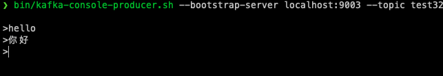
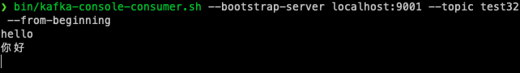

# 第一题

## 1、搭建一个3节点 Kafka 集群，测试功能和性能

1. 安装kafka

   https://kafka.apache.org/downloads

   下载包，解压即可

2. 修改config/server.properties

   将listener那一行打开（取消注释，增加localhost）

3. 开启zookeeper

   bin/zookeeper-server-start.sh config/zookeeper.properties

4. 开启kafka

   bin/kafka-server-start.sh config/server.properties

5. 新建3个配置文件，分别对应三个节点

   每个配置文件修改部分数据：Broker.id、log.dirs、listeners、advertised.listeners

   ```properties
   broker.id=1
   num.network.threads=3
   num.io.threads=8
   socket.send.buffer.bytes=102400
   socket.receive.buffer.bytes=102400
   socket.request.max:bytes=104857600
   log.dirs=/tmp/kafka/kafka-logs1
   num.partitions=1
   num.recovery.threads.per.data.dir=1
   offsets.topic.replication.factor=1
   transaction.state.log.replication.factor=1
   transaction.state.log.min.isr=1
   log.retention.hours=168
   log.segment.bytes=1073741824
   log.retention.check.interval.ms=300000
   zookeeper.connection.timeout.ms=6000000
   delete.topic.enable=true
   group.initial.rebalance.delay.ms=0
   message.max.bytes=5000000
   replica.fetch.max.bytes=5000000
   listeners=PLAINTEXT://localhost:9001
   advertised.listeners=PLAINTEXT://localhost:9001
   broker.list=localhost:9001,localhost:9002,localhost:9003
   zookeeper.connect=localhost:2181
   ```

6. 创建log文件夹

   ❯ mkdir /tmp/kafka/kafka-logs1
   ❯ mkdir /tmp/kafka/kafka-logs2
   ❯ mkdir /tmp/kafka/kafka-logs3

7. 启动zookeeper

   bin/zookeeper-server-start.sh config/zookeeper.properties

8. 启动3个节点

   bin/kafka-server-start.sh config/kafka9001.properties

   bin/kafka-server-start.sh config/kafka9002.properties

   bin/kafka-server-start.sh config/kafka9003.properties

9. 创建topic

   ❯ bin/kafka-topics.sh --bootstrap-server localhost:9001 --create --topic test32 --partitions 3 --replication-factor 2
   Created topic test32.

   查看：

   ❯ bin/kafka-topics.sh --bootstrap-server localhost:9001 --describe --topic test32
   Topic: test32	TopicId: wxyCaSyARIacQOIMrssChQ	PartitionCount: 3	ReplicationFactor: 2	Configs: segment.bytes=1073741824,max.message.bytes=5000000
   	Topic: test32	Partition: 0	Leader: 3	Replicas: 3,1	Isr: 3,1
   	Topic: test32	Partition: 1	Leader: 1	Replicas: 1,2	Isr: 1,2
   	Topic: test32	Partition: 2	Leader: 2	Replicas: 2,3	Isr: 2,3

   - Partition0主副本是3，所有副本在3和1上，Isr表示目前同步的有3和1（3和1的状态一致）

10. 创建生产者和消费者

    生产者：

    ❯ bin/kafka-console-producer.sh --bootstrap-server localhost:9003 --topic test32

    
    
    消费者：
    
    ❯ bin/kafka-console-consumer.sh --bootstrap-server localhost:9001 --topic test32 --from-beginning
    
    
    
10. 对生产者做测试

    ❯ bin/kafka-producer-perf-test.sh --topic test32 --num-records 100000 --record-size 1000 --throughput 200000 --producer-props bootstrap.servers=localhost:9002
    36273 records sent, 7214.2 records/sec (6.88 MB/sec), 807.1 ms avg latency, 1157.0 ms max latency.
    62848 records sent, 12567.1 records/sec (11.98 MB/sec), 581.5 ms avg latency, 964.0 ms max latency.
    100000 records sent, 9809.691976 records/sec (9.36 MB/sec), 662.80 ms avg latency, 1157.00 ms max latency, 688 ms 50th, 1045 ms 95th, 1098 ms 99th, 1142 ms 99.9th.
    
    对消费者做测试
    
    ❯ bin/kafka-consumer-perf-test.sh --bootstrap-server localhost:9002 --topic test32 --fetch-size 1048576 --messages 100000 --threads 1
    WARNING: option [threads] and [num-fetch-threads] have been deprecated and will be ignored by the test
    start.time, end.time, data.consumed.in.MB, MB.sec, data.consumed.in.nMsg, nMsg.sec, rebalance.time.ms, fetch.time.ms, fetch.MB.sec, fetch.nMsg.sec
    2022-05-30 15:36:40:540, 2022-05-30 15:36:41:672, 95.3674, 84.2469, 100002, 88340.9894, 542, 590, 161.6397, 169494.9153


## 2、实现 spring kafka下对 Kafka 集群的操作

### 生产者部分：

1. 添加pom依赖

   ```xml
   <dependency>
     <groupId>org.springframework.boot</groupId>
     <artifactId>spring-boot-starter</artifactId>
   </dependency>
   <dependency>
     <groupId>org.springframework.kafka</groupId>
     <artifactId>spring-kafka</artifactId>
   </dependency>
   <dependency>
     <groupId>com.google.code.gson</groupId>
     <artifactId>gson</artifactId>
     <version>2.8.2</version>
   </dependency>
   <dependency>
     <groupId>org.projectlombok</groupId>
     <artifactId>lombok</artifactId>
     <optional>true</optional>
   </dependency>
   <dependency>
     <groupId>org.springframework.boot</groupId>
     <artifactId>spring-boot-starter-test</artifactId>
     <scope>test</scope>
   </dependency>
   ```

2. 配置application.yml文件

   ```yml
   spring:
     kafka:
       bootstrap-servers: http://localhost:9001,http://localhost:9002,http://localhost:9003
       producer:
         retries: 0
         batch-size: 16384
         buffer-memory: 33554432
         key-serializer: org.apache.kafka.common.serialization.StringSerializer
         value-serializer: org.apache.kafka.common.serialization.StringSerializer
   ```

   

3. 创建实体类，作为传输的信息

   ```java
   package com.zhj6422.kafkaproducer.entity;
   
   import java.util.Date;
   import lombok.Data;
   
   @Data
   public class Message {
     private Long id;    //id
     private String msg; //消息
     private Date sendTime;  //时间戳
   }
   ```

4. KafkaProducer类，使用gson做序列化，通过KafkaTemplate的send方法来发送信息（设置topic，这里的topic要和消费者部分监听的topic一致）

   ```java
   package com.zhj6422.kafkaproducer;
   
   import com.google.gson.Gson;
   import com.google.gson.GsonBuilder;
   import com.zhj6422.kafkaproducer.entity.Message;
   import java.util.Date;
   import java.util.UUID;
   import lombok.extern.slf4j.Slf4j;
   import org.springframework.beans.factory.annotation.Autowired;
   import org.springframework.kafka.core.KafkaTemplate;
   import org.springframework.stereotype.Component;
   
   @Component
   @Slf4j
   public class KafkaProducer {
   
     @Autowired
     private KafkaTemplate<String, String> kafkaTemplate;
   
     private Gson gson = new GsonBuilder().create();
   
     //发送消息方法
     public void send() {
       Message message = new Message();
       message.setId(System.currentTimeMillis());
       message.setMsg(UUID.randomUUID().toString());
       message.setSendTime(new Date());
       log.info("+++++++++++++++++++++  message = {}", gson.toJson(message));
       //topic-ideal为主题
       kafkaTemplate.send("topic-ideal", gson.toJson(message));
     }
   }
   ```

5. 在测试类中尝试发送消息

   ```java
   package com.zhj6422.kafkaproducer;
   
   import org.junit.jupiter.api.Test;
   import org.springframework.beans.factory.annotation.Autowired;
   import org.springframework.boot.test.context.SpringBootTest;
   
   @SpringBootTest
   class KafkaProducerApplicationTests {
   
     @Autowired
     private KafkaProducer kafkaProducer;
   
     @Test
     void contextLoads() {
     }
   
     @Test
     public void kafkaProducer(){
       this.kafkaProducer.send();
     }
   
   }
   ```


### 消费者部分

1. 引入pom依赖：

   ```xml
   <dependency>
     <groupId>org.springframework.boot</groupId>
     <artifactId>spring-boot-starter</artifactId>
   </dependency>
   <dependency>
     <groupId>org.springframework.kafka</groupId>
     <artifactId>spring-kafka</artifactId>
   </dependency>
   <dependency>
     <groupId>com.google.code.gson</groupId>
     <artifactId>gson</artifactId>
     <version>2.8.2</version>
   </dependency>
   <dependency>
     <groupId>org.projectlombok</groupId>
     <artifactId>lombok</artifactId>
     <optional>true</optional>
   </dependency>
   <dependency>
     <groupId>org.springframework.boot</groupId>
     <artifactId>spring-boot-test</artifactId>
     <version>2.7.0</version>
     <scope>test</scope>
   </dependency>
   ```

2. 配置application.yml文件

   ```yml
   server:
     port: 8099
   spring:
     kafka:
       bootstrap-servers: http://127.0.0.1:9001,http://127.0.0.1:9002,http://127.0.0.1:9003
       consumer:
         group-id: test-group
         auto-offset-reset: earliest
         enable-auto-commit: true
         auto-commit-interval: 20000
         value-deserializer: org.apache.kafka.common.serialization.StringDeserializer
   ```

3. 创建KafkaConsumer类，监听对应topic

   ```java
   package com.zhj6422.kafkaconsumer;
   
   import java.util.Optional;
   import lombok.extern.slf4j.Slf4j;
   import org.apache.kafka.clients.consumer.ConsumerRecord;
   import org.springframework.kafka.annotation.KafkaListener;
   import org.springframework.stereotype.Component;
   
   @Component
   @Slf4j
   public class KafkaConsumer {
   
     @KafkaListener(topics = {"topic-test"})
     public void consumer(ConsumerRecord<?, ?> record){
       Optional<?> kafkaMessage = Optional.ofNullable(record.value());
       if (kafkaMessage.isPresent()) {
         Object message = kafkaMessage.get();
         log.info("------------------ record : " + record);
         log.info("------------------ message : " + message);
       }
     }
   }
   ```


### 测试生产者-消费者

1. 启动kafka-consumer部分

2. 在kafka-producer的测试类中，执行testProducer方法

3. consumer部分收到的信息：

   ```
   2022-05-30 17:20:42.802  INFO 73207 --- [ntainer#0-0-C-1] com.zhj6422.kafkaconsumer.KafkaConsumer  : ----------------- record =ConsumerRecord(topic = topic-test, partition = 0, leaderEpoch = 0, offset = 0, CreateTime = 1653902442746, serialized key size = -1, serialized value size = 102, headers = RecordHeaders(headers = [], isReadOnly = false), key = null, value = {"id":1653902442088,"msg":"8711479a-1f37-4b06-8790-4296528edf50","sendTime":"May 30, 2022 5:20:42 PM"})
   2022-05-30 17:20:42.802  INFO 73207 --- [ntainer#0-0-C-1] com.zhj6422.kafkaconsumer.KafkaConsumer  : ------------------ message ={"id":1653902442088,"msg":"8711479a-1f37-4b06-8790-4296528edf50","sendTime":"May 30, 2022 5:20:42 PM"}
   ```

   


